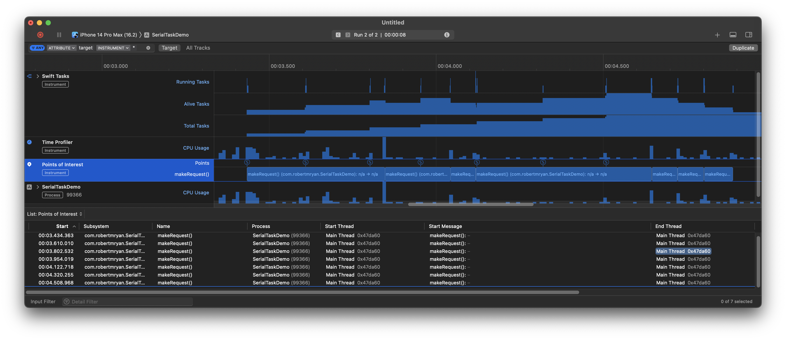

# Serial Asynchronous Tasks

This demonstrates serial behavior of asynchronous tasks using `async`-`await`. In this demo, I simply use an actor, and I `await` the prior task in [`SerialTasks`](SerialTaskDemo/SerialTasks.swift):

```swift
actor SerialTasks<Success> {
    private var previousTask: Task<Success, Error>?

    func add(block: @Sendable @escaping () async throws -> Success) async throws -> Success {
        let task = Task { [previousTask] in
            let _ = await previousTask?.result
            return try await block()
        }
        previousTask = task
        return try await task.value
    }
}
```

E.g., in the [`ViewModel`](SerialTaskDemo/ViewModel.swift), I add a task, and then update a published property with the asynchronously retrieved string, generated dynamically by [https://httpbin.org](https://httpbin.org):

```swift
@MainActor
class ViewModel: ObservableObject {
    private let serialTasks = SerialTasks<String>()

    @Published var string: String = ""

    func makeRequest() async throws {
        string = try await serialTasks.add {
            let url = URL(string: "https://httpbin.org/uuid")!
            let (data, _) = try await URLSession.shared.data(from: url)
            let object = try JSONDecoder().decode(UUIDResponse.self, from: data)
            return object.uuid
        }
    }
}
```

Feel free to add a `try await Task.sleep(for: .seconds(1))` in there if you want to simulate a slower asynchronous process.

FWIW, in the actual project, I actually have some extra code in there, specifically I use “signposts” so I can profile the app (either <kbd>command</kbd>-<kbd>shift</kbd>-<kbd>B</kbd> or use the Xcode menu, “Product” » “Profile”) and view the tasks graphically in Instruments. But in effect, my asynchronous task is a network request, and I return the UUID returned by the [https://httpbin.org](https://httpbin.org) web service.

While watching the behavior in Instruments, I ran the app and then tapped the button as quickly as I could. Those button clicks are represented by the Ⓢ signposts in the “Points of Interest” tool. The intervals represent when the various asynchronous tasks run, and, as you can see, they don't start immediately after hitting the button (the Ⓢ), but rather each request awaits the prior request to finish.



---

© 2022 Robert M. Ryan. All Rights Reserved.

[License](LICENSE.md)
